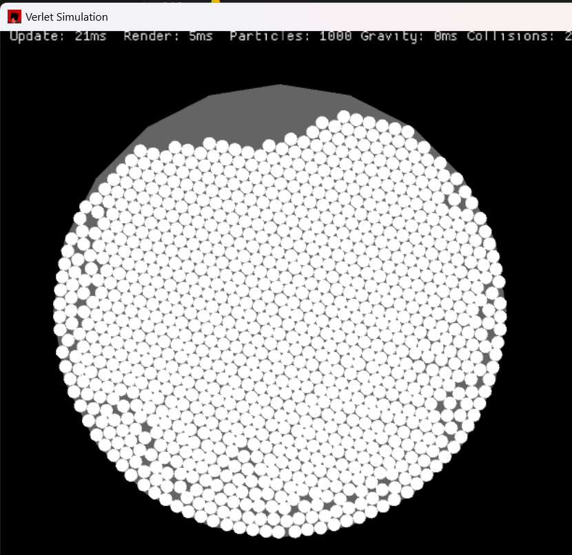

# Verlet Integration in Rust

This project implements a basic Verlet integration simulation in Rust, not optimized for speed yet.

## Features

- Cool particle simulation using Verlet integration
- Real-time rendering of particles
- Collision handling and boundary constraints
- Adjustable parameters for gravity, particle radius, and more

## Prerequisites

- Rust programming language (latest stable version)
- Cargo package manager

## Getting Started

1. **Clone the repository:**

   ```sh
   git clone https://github.com/programordie2/rust-verlet.git
   cd rust-verlet
   ```

2. **Build the project:**

   ```sh
   cargo build --release
   ```

3. **Run the simulation:**

   ```sh
   cargo run --release
   ```

## Configuration

Adjust parameters such as gravity, particle radius, and maximum number of particles in the `src/main.rs` file. These constants are defined at the top of the file for easy modification.

## Screenshot



## License

This project is licensed under the MIT License. See the [LICENSE](LICENSE) file for details.

## Contributing

Contributions are welcome! Please open an issue or submit a pull request for any improvements or bug fixes.

## Acknowledgments

- Inspired by various physics simulation projects and tutorials.
